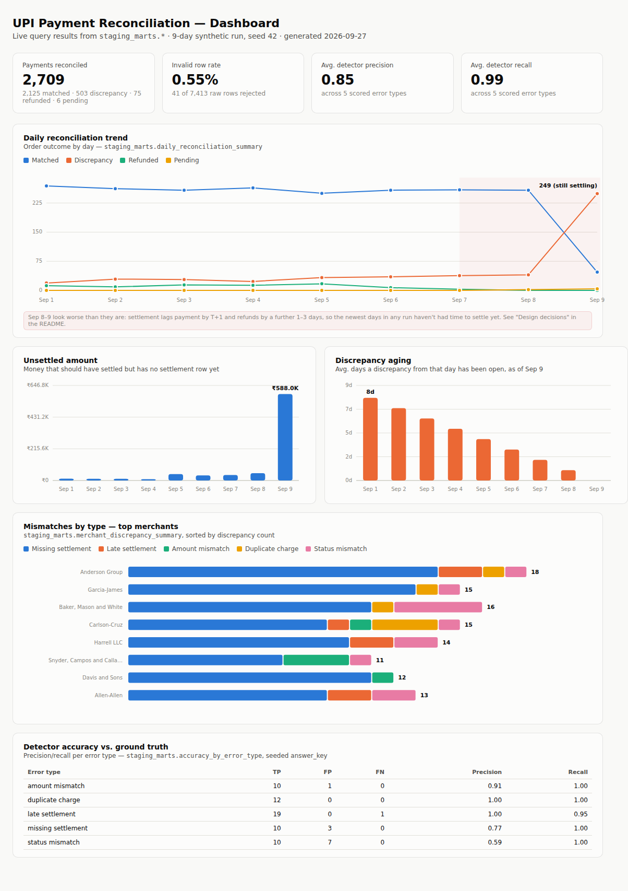

# Dashboard

`docker-compose.yml` includes a `metabase` service alongside Postgres, for
if you want the real thing running locally — see **Metabase setup** below.

## Screenshots



The charts above are real: they're rendered directly from the live query
results of `daily_reconciliation_summary`, `merchant_discrepancy_summary`,
and `accuracy_by_error_type` (9-day / 2,709-order run, seed 42 — the same
numbers cited in the README). They're generated by a small self-contained
HTML page, not Metabase itself — Metabase's jar isn't reachable from every
environment (this repo's own CI sandbox included: no Docker, and
`downloads.metabase.com` is out of reach), so the charts are built with
plain SVG and screenshotted with headless Chromium instead. The queries and
chart choices below are exactly what the Metabase dashboard would show if
you stand it up per **Metabase setup** — regenerating these images after
you have your own data is a matter of re-running the same queries.

Individual charts, if you want to reference one on its own:

| | |
|---|---|
| `daily_reconciliation_trend.png` | Daily reconciliation trend |
| `unsettled_amount.png` | Unsettled amount |
| `discrepancy_aging.png` | Discrepancy aging |
| `merchant_mismatch_breakdown.png` | Mismatches by type, top merchants |
| `detector_accuracy.png` | Precision/recall vs. the seeded answer key |

## Metabase setup

## Start it

```
make docker-up
# ...run make init-db / make generate / make run at least once so the
# marts below have data...
```

Metabase is then at http://localhost:3000. First run walks you through
creating an admin account, then **Add a database**:

- Database type: PostgreSQL
- Host: `postgres` (the docker-compose service name), Port: `5432`
- Database name / user / password: match your `.env`

## Suggested questions / cards

Point each of these at the mart it names — they're already shaped for a
dashboard, so most become a single Metabase "question" with no extra SQL:

| Chart | Source | Notes |
|---|---|---|
| Daily reconciliation trend | `marts.daily_reconciliation_summary` | Line chart of `matched_count` / `discrepancy_count` / `refunded_count` / `pending_count` over `report_date`. |
| Discrepancy rate | `marts.daily_reconciliation_summary` | `discrepancy_rate_pct` as a single-number trend or gauge. |
| Unsettled amount | `marts.daily_reconciliation_summary` | `unsettled_amount` as a trend - money that should have settled but has no settlement row yet. |
| Mismatch aging | `marts.daily_reconciliation_summary` | `avg_discrepancy_age_days` / `max_discrepancy_age_days` by `report_date` - a discrepancy that's still open many days later is a real problem, not just settlement lag. |
| Merchant leaderboard | `marts.merchant_discrepancy_summary` | Table sorted by `discrepancy_rate_pct` desc, or a bar chart of `discrepancy_count` by `name`. |
| Discrepancy breakdown | `marts.merchant_discrepancy_summary` | Stacked bar of `missing_settlement_count` / `late_settlement_count` / `amount_mismatch_count` / `duplicate_charge_count` / `status_mismatch_count` per merchant. |
| Reconciliation drill-down | `marts.fact_reconciliation` | Filterable table for investigating a specific order/merchant/date. |
| Payments ledger | `marts.fact_payments` | Transaction-grain view (every gateway event, incl. duplicates) for a raw payments audit. |

Combine the first four into a single dashboard (**+ New dashboard**), and
add the fifth as a linked detail view via a dashboard filter on
`merchant_id` or `report_date`.

## Pipeline coverage

`daily_reconciliation_summary` and `merchant_discrepancy_summary` are dbt
marts under `dbt_upi/models/marts/`, built and tested the same way as
`fact_reconciliation` (`make dbt-run`, `make dbt-test`) — see
`dbt_upi/models/marts/_marts__models.yml` for their column tests.
